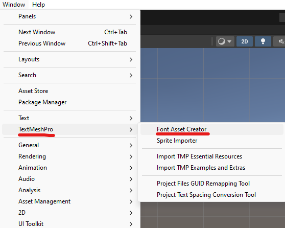
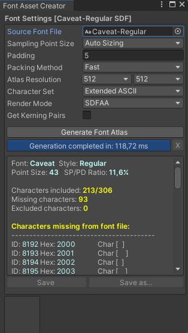
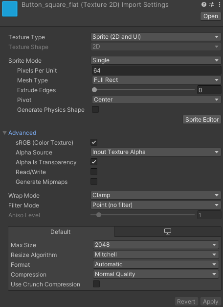
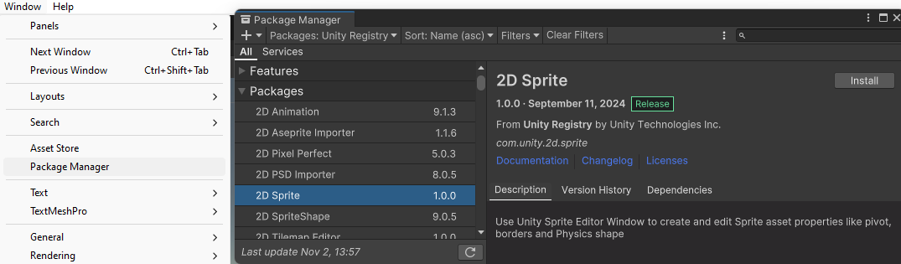
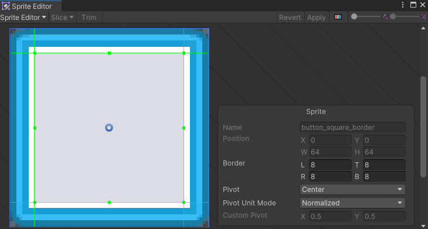
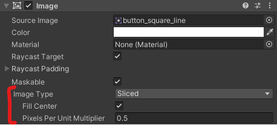

# Unity - ETPA Game 1 2024 - Chapter 3: Dialogues

**Objective**: Use [`ScriptableObject`](https://docs.unity3d.com/Manual/class-ScriptableObject.html) assets to store dialogues, and display them on a UI Canvas.

In Unity, components are meant to be placed in the scene to "add a behavior" to an object. In this chapter, we also need to store data (the dialogue lines), which shouldn't be bound to a scene. To do so, we use a [`ScriptableObject`](https://docs.unity3d.com/Manual/class-ScriptableObject.html), which is meant for exactly that. The goal is to be able to create as manny dialogues as needed for our game, and just "play" them in the scenes on demand.

## Setup

### Add fonts

You can import font files (*.otf or *.ttf) in your project just as you would import a texture. You can download them from [Google Fonts](https://fonts.google.com) for example.

Text in game engines is displayed just like textures are rendered on models: each letter is a texture applied on a "quad" (a square made of 2 triangles). This means that the font must be converted into a texture before it can be used in the game.

The *TextMeshPro* package can do that for us, using the *Font Asset Creator*.

In this utility, set the font you want to convert as a texture, click *Generate Font Atlas*, then click *Save* to create a *TextMeshPro Font Asset*.

Note that this process will create a "static" texture that contains a specific set of characters (we use *Extended ASCII* set, which includes common letters, numbers and accents). It should cover most of your needs.

### UI sprites & 9-slicing

In this example I use [Kenney's UI Pack](https://kenney.nl/assets/ui-pack).

Any sprite meant to be used on UI requires a specific setup. It starts from the import settings:

- **Texture Type** must be set on *Sprite (2D and UI)
- Make sure that **Alpha Source** and **Alpha Is Transparency** match the sprite content (here we use the alpha channel as it's meant for)
- In our case, we set **Filter Mode** to *Point (no filter), because the assets are very small and meant for pixel art games

If we use the sprites as is in the scene, we will stretch them to match the expected dimensions. And that's obviously not what we want. To fix this, we can use "9-slicing", a common technique used in games for UI. The idea is to split an image into 9 parts:

- Corners are not scaled
- Top and bottom edges are scaled only along X axis
- Left and right edges are scaled only along Y axis
- Center is scaled along both axes

Before we can use it, we must add the *2D Sprite* package to our project (which should be already included if you chose the *2D* render pipeline when you created the project).

This package give you access to the *Sprite Editor*. Select a sprite meant to be 9-sliced (button, box, frame, ...), and click on the *Sprite Editor* button. Move the green handles to split the sprite in 9 parts.

Now, you can use the *Sliced* or *Tiled* mode on the `Image` component in UI Canvas. Instead of scaling the image, Unity will now scale parts of the sprite indivdually, following the rules described above.

## Scripts

Here are the scripts created in this chapter, documented using comments.

- [**`DialogueAsset`**](../Assets/_CHAPTERS/03%20Dialogues/DialogueAsset.cs): implements the [`ScriptableObject`](https://docs.unity3d.com/Manual/class-ScriptableObject.html), and stores the dialogue lines to display in the scene.
- [**`DialoguePlayer`**](../Assets/_CHAPTERS/03%20Dialogues/DialoguePlayer.cs): a component that reads a `DialogueAsset` and display dialogue lines on UI.

## Going further

- Store character avatar and name in the `DialogueAsset`, and display it on UI
- Add a `PlayDialogue()` function to the `DialoguePlayer` component to play another dialogue at runtime (instead of just playing one on startup)
- Chain several dialogues: you can use [`Queue<>`](https://learn.microsoft.com/en-us/dotnet/api/system.collections.generic.queue-1) collections to chain dialogue assets instead of just chaining dialogue lines

---

[<= Back to summary](README.md) | [=> Next chapter](./04-cannon-survivor.md)