# Unity - ETPA Game 1 2024 - Guide: Git (ft. GitHub & Fork)

This guide details the steps to setup Git for a Unity project, and how to send/receive updates on that project.

Note that this workflow is really common in the industry, can also be applied to your own solo projects, and is nearly the same process for other game engines and programming languages.

For the sake of simplification, this guide focuses on [GitHub](https://github.com/) as the platform to host online repositories, and [Fork](https://git-fork.com/) as the UI client to work with *Git* from your machine.

## Quick Start

Here is a short list of the steps to do to setup a Unity project with Git, as a quick reminder. Each step is detailed below.

1. Download & install [Git](https://git-scm.com)
2. Downdload & install [Fork](https://git-fork.com/)
3. Create a new *Unity* project
4. Open the project folder in Fork (`File > Open Repository`)
5. Click *Initialize git repository here*
6. Add [this `.gitignore` file](https://github.com/github/gitignore/blob/main/Unity.gitignore) in the root folder (the one that contains `/Assets`, `/Packages`, etc.)
7. Create a repository on [GitHub](https://github.com/)
8. Copy the HTTPS address of the repository (which ends by `.git`)
9. Back in Fork, create the `origin` remote (right-click on `Remotes > Add New Remote...`), and paste the HTTPS address of your *GitHub* repository
10. Move the local changes to *Staged*
11. Write a commit message, click *Commit X files*
12. Click *Push* button

Done :)

## Step by step

### 1,2. Install tools

You need to install two apps on your machine:

- [Git](https://git-scm.com): This is the actual versionning system, able to track the changes of a project and organize its prrogress as *versions*.
- [Fork](https://git-fork.com/): This is a UI client for working with *Git* without opening a *Terminal*. *Git* is a console-based app at first, so without a UI, you can only work with command lines.

Note that there's other versionning system tools, and other UI clients. For example, in your carreer, you may work with [Perforce](https://www.perforce.com/) or [Plastic SCM](https://www.plasticscm.com/), which provide a UI client by default instead of being console-based. All these tools use very similar terms, and UI clients work in similar ways. So if you learn how to use *Git*, you can basically understand and use any other versionning system.

### 3. Create a Unity project

Because you want to use *Git* in your project, take care to disable both *Unity Cloud* and *Unity Version Control* to avoid any conflict with these systems.

Note that Unity suggests to use their own versionning system, which is *Plastic SCM*. It can suit your needs for a very small teams, but your project would be less shareable than a platform like *GitHub*, and is not free past a certain amount of files or co-workers. Also, this system is obviously very bound to *Unity*, and can't be used for your other projects.

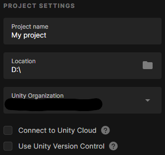

### 4,5. Open local repository

In *Fork*, open your Unity project's root folder (the one that contains `/Assets`, `/Packages`, etc.). Fork will notify you that the directory is "not under Git source control". Click *Initialize git repository here*, so *Fork* can setup *Git* in your project for you.

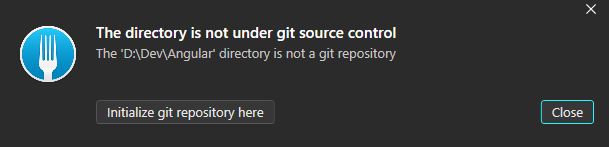

This adds a `/.git` folder in your project (which is hidden by default), which is automatically managed by *Git* to track the state and changes of your project.

And now you need to solve this:

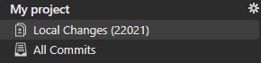

### 6. Add `.gitignore`

If you open your *Unity* project in *Fork* at this step, you will see that there's A LOT of local changes (at least more than 10.000 files). This is because game engines (and so does *Unity*) often generate cache and log files automatically after you open the project for the first time, mostly in order to reduce loading delays in the future.

Since these files are automatically generated by the engine, we can ignore them, so they won't be uploaded to the online repository or even visible in your local repository. If you skip this step, your repository will quickly be saturated with heavy unnecessary files, or even cause errors when opened by other members of your team.

Over time, developers all around the world have created and maintained [a repository on *GitHub* with ready-to-use `.gitignore` files](https://github.com/github/gitignore) for nearly every development softwares. So instead of ignoring the cache folders or unnecessary files manually, we can count on the existing templates.

Open the [`.gitignore` file for *Unity*](https://github.com/github/gitignore/blob/main/Unity.gitignore), and download it. Rename it `.gitignore` (with no name, only the extension), and move it to the root folder of your *Unity* project (the one that contains `/Assets`, `/Packages`, etc.).

When *Git* finds a `.gitignore` file in a folder, it will automatically read it and ignore the mentionned files and folders. If done correctly, go back to *Fork* and you should see a more reasonnable number of changes.

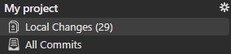

If nothing changed:

- Make sure that you remove the `.txt` extension of the `.gitignore` file
- Make sure that the `.gitignore` file has no name, only the extension
- Make sure that *Windows* recognizes it as a "source file" and not a text file. If not, file extensions are probably hidden in your Windows Explorer, so you can't see that the file still uses a `.txt` extension.

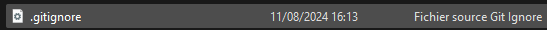
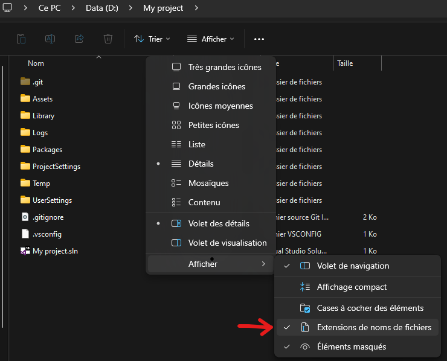

### 7. Create *GitHub* repository

[GitHub](https://github.com/) is a platform that hosts "repositories". Repositories are basically online folders that can be synced with *Git*, and allow entire teams to work on the same project simultaneously.

Once you've created an account on [GitHub](https://github.com/), connect to it and create a new repository by clicking on the green *New* button. About the settings:

- The **repository name** also defines the URL of your repository
- A **Public** repository can be visible by anyone, and a **Private** reopsitory is only visible by its creator and its authorized members. In any case, only authorized members are allowed to commit and push changes. So even with a **Public** repository, there's no risk for your projects to be changed by random people.
- **Don't add a README file**. Adding any file in the project would create a first commit automatically. But the problem is that you wouldn't be able to commmit your own *Unity* project inside that online repository just because they have unrelated work trees.
- **Don't select a `.gitignore`**. For the same reasons as for the *README* file. You should've manually add it to your *Unity* project anyway.
- **Don't add a license**. Again, that would create an initial commit and so create an unrelated work tree.

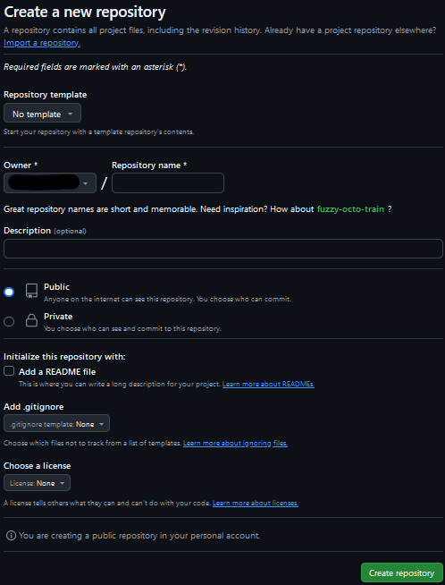

### 8,9. Bind local and online repositories

Once you've created a new empty repository, *GitHub* displays an HTTPS address that ends with `.git`. Copy that address, we will use it to bind your local repository (basically, your *Unity* project) with your brand new online repository.

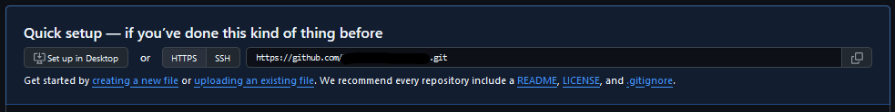

In *Fork*, with your *Unity* project opened, right-click on *Remotes* (in the sidebar on the left), then *Add New Remote...".

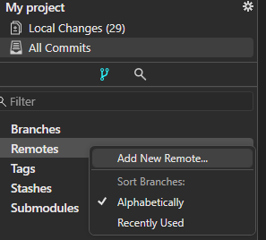

Paste the HTTPS address of your *GitHub* repository if it's not already set in the *Add Remote* window, name it `origin` (which is a convention for the "main" remote of a repository), and click *Add New Remote*.

By adding a new remote, you bascially tells *Git* "whenever I want to send or receive files, it's from this address".

### 10,11,12. First commit

In *Fork*, select the *Local Changes* tab. You can see two sections:

- ***Unstaged***: Contains all the changes you've made locally (add, modity, rename or delete files) and are not meant to be part of your next commit. These changes are known only by your "local" environment, nobody else in the team can see them.
- ***Staged***: Contains all the changes you want to include in your next commit. You can chose to send all your changes are only some of them, at will. At this step, these changes are still only in your local environment, but will be visible by the other members of your team as soon as you push them.

A *commit* is basically a list of changes. For now, we want to do our first commit, so we should stage all the local changes. To do so, you can select all the files in the ***Unstaged*** section (Ctrl + A), and drag and drop then into the ***Staged*** section (or click on the *Stage* button). By doing so, you're telling *Git* "I want these changes to be part of my next commit".

Before committing any change, you must write a *Commit subject*, which is a message visible by anyone in the team that tells why yu have made that commit. **Please don't write stupid messages**: these messages can help one to understand what happened and so what could have caused an issue if a problem occurs in your project at some point in time. So be concise, clear, and keep your jokes in cage.

After writing a commit message in *Fork*, you can see that the *Commit* button (in the bottom-right corner) is now enabled.

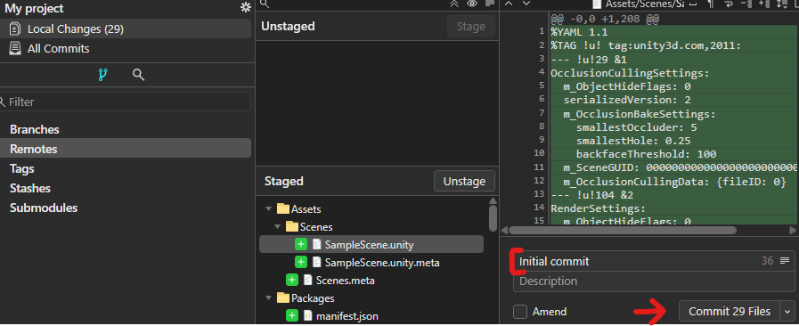

Click on *Commit X files* button. This has two results:

- Your changes are no more visible in the *Local Changes* tab
- A new *branch* named `master` has appeared in the sidebar on the left

In *Git*, branches are basically a list of commmits that starts from a point in time and end to another. By convention, the `master` (or `main`) is the main branch of your project, which contain the more up-to-date working version. For now, that's not really relevant to you.

If you click on that branch or on the *All Commits* tab, you will see your last commit, with date and signature. Making a commit only "save" your changes, but for now, your commit only exists locally. So the next step is to upload it to your online repository.

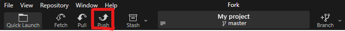

To do so, click on the *Push* button, in the main toolbar. In the *Push* popup, just make sure that the branch to push is `master`, and the target remote is `origin`. If the *Remove* field is empty, you may have skipped the previous steps (*8,9. Bind local and online repositories*). If everything is ok, click *Push*.

If this is your first push ever from your machine, Fork will invite you to connect to your *GitHub* account, so you get authorization to send files to the online repository.

Once *Fork* finishes uploading the files, refresh the homepage of your repository on *GitHub*, and you should see your uploaded files. Congrats!

## Work with existing projects

The steps detailed above are for creating a new repository and setup a new *Unity* project with *Git*. But what if the project has already been created, so now you want to get it to another machine? Or get the changes done by another member of the team?

### Get a project (clone)

When you go to a repository homepage on *GitHub*, you can find a button to download the project as a `.zip` archive. But this is not how things work with a versionning system. Downloading the project will get the files for sure, but you won't be able to keep that project synced with the changes that may occur in the future.

Instead, to keep things in sync, you can ***Clone*** the project, which means get both the files and the *Git* work tree.

To do so, click on the green *Code* button on the homepage of the *GitHub* repository you want to clone, and copy the HTTPS address that ends with `.git`. In *Fork*, go to `File > Clone...`, and paste the HTTPS address you've just copied if it's not already set. Set the folder to which you want the project files to be downloaded, click *Clone*, and it's done.

### Get the changes (pull)

With a repository opened in *Fork*, you can get the latest changes by clicking on the *Pull* button in the main toolbar. This will download the latest commits and update the state of your local projects.

An error may occur if you have uncommitted changes (basically, it happens when you have *Local Changes*). You'll have to either commit, discard or stash these changes before you can pull the project.

### Send your changes (push)

You can follow the 10, 11 and 12th steps detailed above to push your latest changes on an existing project. The workflow is the same:

- Go to the *Local Changes* tab in Fork
- Move the changes to commit from the ***Unstaged*** section to the ***Staged*** section (drag and drop or *Stage* button)
- Write a commit message
- Click the *Commit X files* button
- Click on the *Push* button in the main toolbar

## Why all this pain?

Using a versionning system may seem to be a waste of time before you get used to it. But these tools solve a lot of problems that may occur during a long-term production. Just to name a few...

### Cancel changes safely

When you want to try some changes to an existing feature or try create a new one "just to see if it works", it can lead to unexpected errors or just messy block of codes that shouldn't stay in the project. Without a versionning system, you have to discard these changes manually, by pressing the *Undo* shortcut a stupid amount of times on every modified file, or just deleting things manually. Which can lead to other errors, including you forgetting that you've changed a file that shoudln't have changed.

If you use the versionning system wisely, you can "save" the state of your project by creating a commit just before trying to add that new feature. If something wrong happens during its development, you can litterally discard all the changes from that latest "safe" commit, instead of removing the changes by hand. And from there, you can try another solution safely.

### Rollback to a previous version

You can "navigate" between commits. In *Fork*, if you don't have any pending changes, you can try double-clicking on previous commits to navigate to a previous version of the project. This is especially useful in two scenarios:

#### The project changed

Say you've made decisions in the game design that now make the latest features unrelevant to your game. Instead of removing these features, you can rollback to a previous version of the project, and start a new branch from there. This way, you can just "reorient" the project without losing the work that have bene done before.

#### Savage bug has appeared

Bugs can be introduced unintentionnally when adding or changing features, it's a common thing in game development. But some of them are not important or even not visible... until they become critical at some point.

**Debugging a system is just like a police investigation**: you want to know who changed something, what changed, and when that change has occurred.

Without a versionning system, it can be difficult to get these informations, which makes the debug process painful. Using a versionning system, you can easily navigate to previous commits, and check exactly when the bug has appeared. Once you identfy what commit introduced the bug, you instantly know who made it, what files have changed, and when it happened. From there, you just have to check the changed files.

---

[<= Back to summary](README.md)