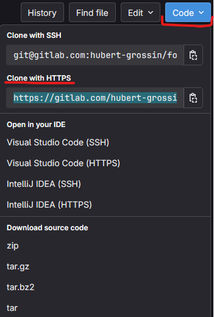
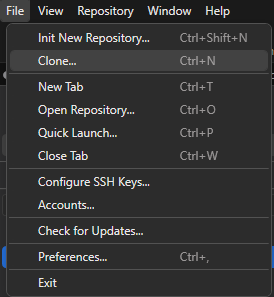
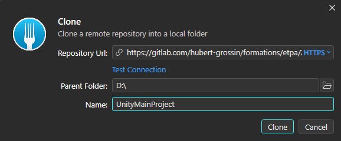
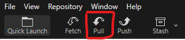

# Unity - ETPA Game 1 2024

Ce projet Unity contient l'essentiel de ce que nous avons vu et fait en cours. Vous y trouverez également quelques documents sur l'utilisation du moteur ou du C# (le langage de programmation utilisé sur Unity) dans le dossier [`/Documentation`](./Documentation/).

Vous noterez qu'en dehors de cette page, le contenu de la documentation est rédigé en anglais, d'une part pour servir d'exemple, mais surtout parce que l'essentiel des ressources que vous trouverez dans ce domaine sont dans cette langue.

Vous pourrez utiliser ce projet comme référence pendant votre cursus, et il restera à votre disposition après votre parcours. S'il devait manquer des informations, vous pouvez me contacter par e-mail à [formations@hubertg.fr](mailto:formations@hubertg.fr).

## Récupérer le projet

Pour récupérer le projet sur votre machine, vous pouvez directement le télécharger sous forme d'archive `.zip` depuis GitLab, ou le cloner via [Git](https://git-scm.com) si vous souhaitez récupérer ses différentes mises à jour au fil de l'année.

### Cloner le projet via [Git](https://git-scm.com)

Avant de commencer, vous devez installer sur votre machine :

- [**Git**](https://git-scm.com), qui est un gestionnaire de versions de fichiers, utilisé pour traquer les changements sur un projet, sauvegarder ses changements et se synchroniser avec d'autres membres de l'équipe
- [**Fork**](https://git-fork.com), qui est une interface pour manipuler *Git* et s'éviter de travailler uniquement en lignes de commande

Une fois installé, vous pouvez lancer *Fork*, et suivre ces étapes :

1. Cliquez sur le bouton *Cloner* sur *GitLab*, et copiez l'adresse `*.git` du repository

2. Ouvrez *Fork*, puis allez dans *File > Clone...*

3. Collez l'adresse si elle n'apparaît pas déjà sur la fenêtre, puis sélectionnez le dossier dans lequel le projet sera cloné. Vous pouvez également indiquer un nom plus parlant dans le champs *Name*, qui sera alors le nom de l'onglet qui apparaîtra dans *Fork* pour ce projet.

4. Cliquez sur le bouton *Clone*. Le projet étant public, il ne vous sera pas demandé de vous identifier. Attendez que *Fork* récupère les fichiers du projet.

### Mettre à jour le projet

Vous pouvez récupérer tous les derniers changements effectués sur le projet en effectuant un *pull*.

Dans *Fork*, ouvrez le repository du projet sur votre machine (ou allez sur l'onglet s'il est déjà ouvert), puis cliquez sur le bouton *Pull*.

